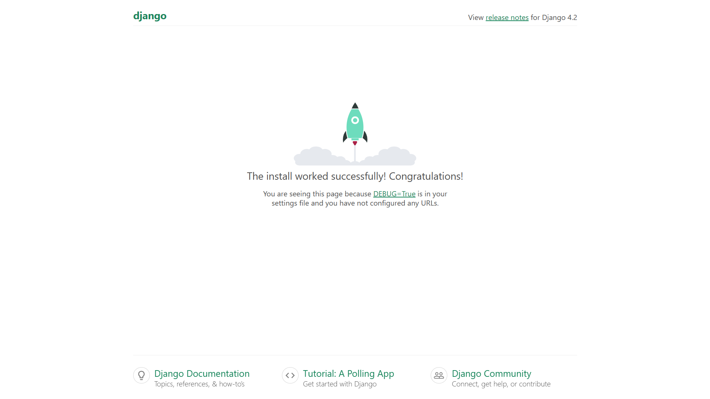

# Iniciar proyecto

## ¿Qué es un proyecto en Django?

Un proyecto en Django es un conjunto de configuraciones y aplicaciones que trabajan juntas para lograr un objetivo común. Un proyecto puede contener una o más aplicaciones, y cada aplicación puede ser reutilizada en otros proyectos.


## Crear un proyecto

para iniciar un proyecto de Django, ejecuta el siguiente comando:

```bash
django-admin startproject mysite
```
lo que realizará el comando es crear un nuevo directorio llamado `mysite` con la siguiente estructura:

```plaintext
mysite/
    manage.py
    mysite/
        __init__.py
        settings.py
        urls.py
        asgi.py
        wsgi.py
```

ya que el proyecto ha sido creado, puedes iniciar el servidor de desarrollo con el siguiente comando:

```bash
python manage.py runserver
```

después de ejecutar el comando, podrás acceder a tu proyecto en la dirección `http://localhost:8000/`.

Asi se verá tu proyecto en el navegador:


:::note
Para más información sobre el comando `startproject`, puedes consultar la [documentación oficial](https://docs.djangoproject.com/en/3.2/ref/django-admin/#startproject).
:::

